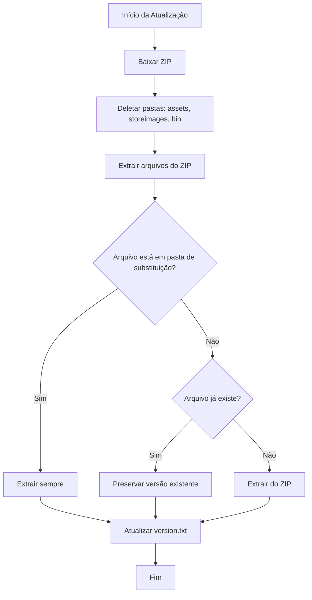

# Sistema de Substituição Seletiva de Pastas

## 📋 Resumo

O launcher agora possui um sistema inteligente de atualização que **preserva configurações do usuário** enquanto atualiza os arquivos essenciais do jogo.

## 🎯 Como Funciona

### Pastas que São Substituídas (SEMPRE sobrescritas)

Estas pastas são **completamente deletadas e recriadas** a cada atualização:

1. **`assets/`** - Recursos visuais (sprites, texturas, mapas)
2. **`storeimages/`** - Imagens da loja in-game
3. **`bin/`** - Bibliotecas e binários do cliente

### Arquivos que São Preservados

Todos os outros arquivos **mantêm suas versões existentes**:

- ✅ `clientoptions.json` - Configurações do usuário
- ✅ Arquivos de hotkeys customizadas
- ✅ Minimapa personalizado
- ✅ Configurações de interface
- ✅ Qualquer arquivo criado pelo usuário

## 🔧 Implementação Técnica

### Código Principal

Localização: `src-tauri/src/main.rs` linha 81

```rust
const REPLACE_FOLDERS: &[&str] = &["assets", "storeimages", "bin"];
```

### Fluxo de Atualização



## 📝 Exemplo Prático

### Antes da Atualização
```
AppData/Local/koliseu-launcher/client/
├── Tibia.exe (v1.0)
├── clientoptions.json (configurações personalizadas)
├── assets/ (v1.0)
│   └── sprites.spr
├── storeimages/ (v1.0)
│   └── item001.png
├── bin/ (v1.0)
│   └── library.dll
├── data/
│   └── player_map.dat (mapa customizado)
└── version.txt (1.0)
```

### Durante a Atualização
```
1. DELETE: assets/
2. DELETE: storeimages/
3. DELETE: bin/
4. EXTRACT from ZIP:
   - assets/ (v1.1) → Extrai
   - storeimages/ (v1.1) → Extrai
   - bin/ (v1.1) → Extrai
   - Tibia.exe (v1.1) → JÁ EXISTE, PRESERVA v1.0
   - clientoptions.json → JÁ EXISTE, PRESERVA
   - data/player_map.dat → JÁ EXISTE, PRESERVA
```

### Após a Atualização
```
AppData/Local/koliseu-launcher/client/
├── Tibia.exe (v1.0 - PRESERVADO)
├── clientoptions.json (PRESERVADO - configurações mantidas!)
├── assets/ (v1.1 - ATUALIZADO)
│   └── sprites.spr (novo)
├── storeimages/ (v1.1 - ATUALIZADO)
│   └── item001.png (novo)
├── bin/ (v1.1 - ATUALIZADO)
│   └── library.dll (novo)
├── data/
│   └── player_map.dat (PRESERVADO - mapa customizado mantido!)
└── version.txt (1.1)
```

## ⚙️ Como Modificar as Pastas de Substituição

Se você precisar adicionar ou remover pastas da lista de substituição:

1. Abra `src-tauri/src/main.rs`
2. Localize a linha 81:
   ```rust
   const REPLACE_FOLDERS: &[&str] = &["assets", "storeimages", "bin"];
   ```
3. Adicione ou remova pastas da lista:
   ```rust
   const REPLACE_FOLDERS: &[&str] = &["assets", "storeimages", "bin", "nova_pasta"];
   ```

### ⚠️ Avisos Importantes

- **Não adicione** pastas que contêm saves ou configurações do usuário
- **Não adicione** a pasta raiz (`""`) - isso sobrescreveria tudo
- **Sempre teste** após modificar a lista

### Exemplos do que NÃO fazer:

❌ **ERRADO** - Vai deletar saves do usuário:
```rust
const REPLACE_FOLDERS: &[&str] = &["assets", "storeimages", "bin", "saves"];
```

❌ **ERRADO** - Vai deletar configurações:
```rust
const REPLACE_FOLDERS: &[&str] = &["assets", "storeimages", "bin", "config"];
```

✅ **CORRETO** - Apenas recursos do jogo:
```rust
const REPLACE_FOLDERS: &[&str] = &["assets", "storeimages", "bin"];
```

## 🧪 Testando

Para testar o sistema de substituição seletiva:

1. **Primeira instalação**: Execute o launcher e instale o cliente
2. **Modifique um arquivo**: Edite `clientoptions.json` com alguma configuração
3. **Simule atualização**: Aumente a versão no servidor e faça uma atualização
4. **Verifique**:
   - ✅ `clientoptions.json` deve manter suas modificações
   - ✅ Pastas `assets/`, `storeimages/`, `bin/` devem ter versões novas
   - ✅ Arquivo `version.txt` deve ter a nova versão

## 📊 Benefícios

✅ **Preserva configurações do usuário** - Não perde hotkeys, configs, etc.
✅ **Atualiza recursos críticos** - Assets e bibliotecas sempre atualizados
✅ **Reduz tamanho de download** - Não baixa arquivos que não mudam
✅ **Mais rápido** - Não sobrescreve desnecessariamente
✅ **Seguro** - Impossível perder dados do usuário nas pastas protegidas

## 🔍 Troubleshooting

### Problema: Pasta não está sendo atualizada

**Solução**: Verifique se a pasta está na lista `REPLACE_FOLDERS`

### Problema: Configurações sendo perdidas

**Solução**: **REMOVA** a pasta da lista `REPLACE_FOLDERS` - ela não deveria estar lá!

### Problema: Arquivos antigos persistindo

**Solução**: Se um arquivo específico precisa ser sempre atualizado, coloque-o dentro de uma pasta que está em `REPLACE_FOLDERS`

---

**Última atualização**: 2025-10-02
**Versão**: 1.0.0
